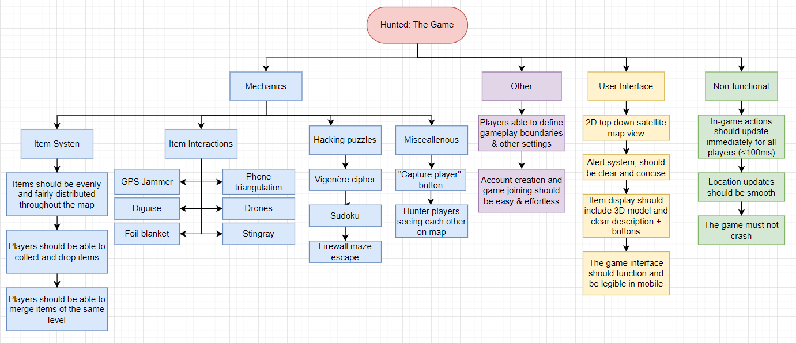

# 2.2.7 Cycle 7: Catching players

## Design

### Objectives

I concede that it seems strange to pivot from adding more item mechanics, to follow on from [cycle-1-4.md](cycle-1-4.md "mention"), however, there is a reason for it. Throughout the development I have started to realise that the scope of my project may have been too large, and my features proposed in [1.4a-features-of-the-proposed-solution.md](../1-analysis/1.4a-features-of-the-proposed-solution.md "mention") are unlikely to be fully implemented. Therefore, I will implement the ability to catch players, and for a certain team to "win" the game. This will ensure that the game is playable, and could be presented as an MVP (minimum viable product). To achieve this, there are several things I intend to add:

* [x] A game time setting in the creation page, which, once reached, will cause the game to end and the "Hunted" team to be declared victorious.
* [x] A "Catch" screen should appear when a Hunter is within 5m of a player, which will cause the game to end for the Hunted player when clicked (spectator mode TBA in a later cycle)
* [x] The game should end and the Hunters declared victorious once all Hunted players are caught

### Usability Features

* The game duration should be visible. I will change the game time indicator to a countdown
* There should be 10 minute, 5 minute and 1 minute countdown messages sent towards the end of the game
* The Catch button should be large and appear on top of the map
* When a game ends and a team wins, there should be alternate "You Win/Lose" message broadcast to players screens

### Key Variables

| Variable name         | Use                                                                      |
| --------------------- | ------------------------------------------------------------------------ |
| game.options.duration | A game object attribute that will store the max game duration in seconds |
| player.catching       | Stores the player that is being caught                                   |
| player.catchers       | Stores the players catching the player                                   |

### Pseudocode

```
subroutine player_location_update(player, location)
    if (player.type = "hunter")
        for huntedPlayer of huntedPlayers
            if (distance(huntedPlayer.location, location) < 6)
                send message catch-enabled with huntedPlayer details to player
            end if
        end for
    end if
    ...
end subroutine

subroutine on_catch_message(huntedPlayer
    if (distance(huntedPlayer.location, location) < 6)
        set huntedPlayer status to spectator
        send message game-over to huntedPlayer
        send message catch-disabled to player
        if (no more hunted players)
            end_game()
        end if
    end if
end subroutine

subroutine game_start(game)
    ...
    set timeout (duration: game.duration) end_game()
end subroutine

subroutine end_game()
    if (huntedPlayers length > 0)
        broadcast hunted players won
    else
        broadcast hunters won
    remove game from games list
end subroutine
```

### UI Mockup

<figure><figcaption><p>From Left to Right: The catch screen, shown when a Hunter is near a Hunted Player; A win screen with a blue overlay, that exists the game with a countdown; A red lose screen</p></figcaption></figure>

## Development

This cycle was fairly simple to implement; refactoring done in [cycle-1-3.md](cycle-1-3.md "mention") made new socket events and game logic easy to implement. &#x20;

### Catching Players

On each location update from every player I will calculate if catching is possible. For instance, if the player sending a location update is a _hunted_ player, then the game will check whether there are any hunters within a given range (10m) and vice-versa for hunters. There are two attributes that get changed when a catch is possible:

* On the **Hunter:** An attribute called `catchable` stores a reference to the player that can be caught
* On the **Hunted:** An attribute called `catchers` stores a list of all the hunters that are able to catch&#x20;

```typescript
updateLocation(location: GeolocationCoordinates) {
  this.location = location

  if (this.type === 'hunter') {
    this.socket.to(this.game.id + 'hunter').emit('player-location', {
      id: this.id,
      location: this.location,
    });
  } else {
    // If the player is hunted, check whether it has any catchers - if it does, check
    // whether each one is in range of the new location - if it is, remove it as a
    // catcher.
    if (this.catchers.length) {
      this.catchers.forEach(c => {
        if (c.location && distance(c.location, this.location!) > 10) {
          c.unsetCatchable();
        }
      });
    }
  }
  
  // Finds the first player *of the opposite team* which is within range
  const playerInRange = this.game[this.type === 'hunter' ? 'hunted' : 'hunter'].filter(p => {
    return p.location && distance(p.location, this.location!) <= 10;
  })[0];

  if (playerInRange) {
    if (this.type === 'hunted') {
      // If the player is "hunted", set the player as catchable by playerInRange
      playerInRange.setCatchable(this);
    } else {
    // If the player is a hunter, set playerInRange as catchable by the player
      this.setCatchable(playerInRange);
    }
  } else if (this.catching) {
    // If there is no player in range, remove any catchable 
    // attributes on the current player
    this.unsetCatchable();
  }
}
```

**Setting and unsetting** a player as being able to catch another player is handled through these two functions:

```typescript
setCatchable(player: Player) {
  this.catching = player;
  player.catchers.push(this);
  this.socket.emit('player-catch-on', player.getPublic());
}

unsetCatchable() {
  if (this.catching) {
    this.catching.catchers = [];
    this.socket.emit('player-catch-off', {id: this.catching.id});
    this.catching = null;
  }
}
```

These functions modify the appropriate attributes on the player and broadcast these updates to the client. The client listeners for these events, and then updates its local array of `players` accordingly. The catch overlay will be rendered if the player has a truthy `catching` attribute.

```typescript
setPlayers(prev => [
    ...prev.filter(p => p.id !== me.id),
    {...me, catching: {id: data.id, username: data.username}},
]);
```

When the client presses on the 🔴 _Catch_ button, it sends a `player-caught` message to the server, where it is validated, and then:

* A catch message is broadcast to all players, including the one which is caught.&#x20;
* The caught player is removed from the game player list

On receipt of this catch message on the client, this subroutine will execute:

_Client_

```typescript
'player-caught': data => {
  // The players list is updated, with a status to reflect the newly caught player.
  // The player is not removed client-side to make it easier to add a future spectator
  // mode.
  setPlayers(prev => prev.map(p => (p.id === data.id ? {...p, status: 'caught'} : p)));
  if (data.id !== me?.id) {
    // If the caught player is not the user, display a positive or a negative message,
    // to tell the user who was caught
    toast[me?.type === 'hunter' ? 'success' : 'error'](`${data.username} caught!`);
  } else {
    // If it is the user, send them a caught message before removing them from 
    // the game (the socket is disconnected server-side)
    toast.error(`You were caught! Game Over`);
    setTimeout(() => {
      setGame(null);
      setSocket(null);
    }, 2000);
  }
},
```

_Server_

```typescript
catch(player: Player) {
    // The player's underlying socket is disconnected
    player.socket.disconnect(true);
    // The game's player lists are updated, removing the caught player
    this.hunted = this.hunted.filter(p => p.id !== this.id);
    this.players = this.players.filter(p => p.id !== this.id);
    ...
}
```

### Game Over

The two ways a game can end are as follows:

* All Hunted players are caught, meaning the **Hunters** are the winners

```typescript
catch(player: Player) {
  ...
  this.hunted = this.hunted.filter(p => p.id !== this.id);
  if (!this.hunted.length) {
    // If there are no `hunted` players, the hunters have won, as all hunted players 
    // have been caught - this is broadcast to all players
    io.to(this.id).emit('game-end', {
      team: 'hunter',
    });
    // Clears the existing timeout, to prevent ghost function calls after the game
    // has ended (see below)
    this.timeout && clearTimeout(this.timeout);
  }
}
```

* The maximum game duration is reached, meaning the **Hunted** players are the winners

When the game starts, a `setTimeout` is called and added to the game object, which will broadcast an end game message when the time is up

```typescript
start() {
  ...
  // Added to game object as `timeout`
  this.timeout = setTimeout(() => {
    // As the time has expired, and no winners have yet been declared, the hunted
    // team must be the winners - this is broadcast to all players
    io.to(this.id).emit('game-end', {
      team: 'hunted',
    });
    // The game duration in milliseconds
  }, this.options.duration * 60 * 1000);
}
```

As mentioned in [#usability-features](2.2.7-cycle-7-catching-players.md#usability-features "mention"), I made sure to update the game time indicator to countdown and display messages when there were 10, 5 and 1 minutes left.

```typescript
useEffect(() => {
  // Runs every second
  const interval = setInterval(() => {
    if (game?.startTime) {
      // The new countdown time, calculated by sutracting the current game time,
      // from its duration.
      const newTime = game.options.duration * 60 - Math.floor((Date.now() - game.startTime) / 1000);
      // Broadcasts messages at various times, with a "i" icon, as it is a neutral
      // message
      if (newTime === 10 * 60) toast('10 minutes left!', {duration: 5000, icon: 'ℹ️'});
      if (newTime === 5 * 60) toast('5 minutes left!', {duration: 5000, icon: 'ℹ️'});
      if (newTime === 60) toast('1 minute left!', {duration: 5000, icon: 'ℹ️'});

      setTime(newTime);
    }
  }, 1000);
  return () => clearInterval(interval);
}, [game, time]);
```

When the client receives this message, it updates the local game object to state the game has ended and which team has won. Once this game object is updated with the `hasEnded` attribute, a overlay is displayed, as shown in [#ui-mockup](2.2.7-cycle-7-catching-players.md#ui-mockup "mention"):&#x20;

```typescript
export const WinLose = () => {
  const me = useMe();
  const [game, setGame] = useGame();
  const [socket, setSocket] = useAtom(socketAtom);
  const [countdown, setCountdown] = useState(10);

  useEffect(() => {
    // Creates a ten second countdown that disconnects the player from the game
    // once it reaches zero.
    const interval = setInterval(() => {
      if (countdown === 0) {
        socket?.disconnect();
        setGame(null);
        setSocket(null);
      }
      setCountdown(prev => prev - 1);
    }, 1000);
    return () => clearInterval(interval);
  }, [countdown]);
  
  // Ensures that the required attributes are present
  if (!game || !me || !game.hasEnded || !game.winningTeam) return null;

  // Creates variable to store player winning status
  const isWinner = game.winningTeam === me.type;

  return (
    // Displays an overlay with appropriate background and message depending on
    // value of `isWinner`
    <Overlay bg={isWinner ? 'rgba(81,127,218,0.8)' : 'rgba(218,81,81,0.8)'}>
      <Text fontSize={'5vw'} color={'white'}>
        {isWinner ? 'Congratulations' : 'Maybe next time'}
      </Text>
      <Heading fontSize={'15vw'} color={'white'}>
        {me.type.toUpperCase()} {isWinner ? 'WIN' : 'LOSE'}
      </Heading>
      <Text fontSize={'3vw'} color={'white'}>
        Exiting in {countdown}
      </Text>
    </Overlay>
  );
};
```

### Challenges

There were very few challenges encountered in this cycle due to the easily extendible classes and listeners as mentioned earlier. There were some minor issues regarding the various `useEffect` hooks, when I didn't pass in its dependencies, causing buggy behaviour, whether the countdown would skip, or&#x20;
