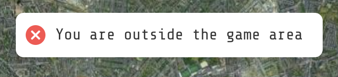

# 2.2.9 Cycle 9: GPS Jammer & Drone search


If you are prone to epileptic fits, please skip [#undefined](2.2.9-cycle-9-gps-jammer-and-drone-search.md#undefined "mention").


## Design

### Objectives

In this cycle I will aim to create both the GPS Jammer and Drone search items, complete with all their functionality. I will not implement merging items (as mentioned in [#item-interactions](../1-analysis/1.4a-features-of-the-proposed-solution.md#item-interactions "mention")). This will ensure that the game has additional features beyond typical "hide-and-seek" behaviour, and will mean that some of the items displayed on the map will be useful. I will also seek to implement different intensity of actions depending on the items rarity. Drone recharging will not be added in this cycle.

* [ ] Create GPS Jammer item: Need to disable GPS and map rendering on nearby Hunted clients
* [ ] Create Drone search item: Need to create a heat-map display and render it to the client
* [ ] Implement action intensities dependent on item rarity

### Usability

* [ ] Clearly show the action intensity on the action button - for instance, a common GPS Jammer may say "JAM GPS (2 mins)" whereas an epic GPS Jammer would say "JAM GPS (10 minutes).
* [ ] Show when an item is in use, i.e. with a coloured background in the inventory
* [ ] Create visual or audio effects for when an item affects another player
  * [ ] Drone: A quiet buzzing should be audible for nearby Hunted players
  * [ ] GPS Jammer: A constant glitching animation should visible on the map screen for nearby all Hunters

### Key Variables

| Variable name  | Use                                                               |
| -------------- | ----------------------------------------------------------------- |
| item.active    | Stores a boolean value of whether or not the item is active.      |
| player.items   | Stores all items contained in a player                            |
| player.effects | Stores effects active on player - buzzing noise, or map glitching |

### Pseudocode

<pre><code><strong>subroutine on_action_click (item, player)
</strong>    send message to server
    message recieved by server
    send item-active message to requesting player
    applicable_players = get nearby players not of item.type
    send effect-active to applicable players
    
    add effect to effects of applicable_players
    set item.active = true
    
    subroutine timeout for item.effect.duration
        send an effect-disabled to players with item.effect.id in effects list
        send an item-disabled message to player
        set item.active = false
        set item.used = true
    end subroutine        
end subroutine

subroutine on_receipt_effect_active (effect)
    switch (effect)
        case 'gps-glitch'
            display map glitch overlay
        case 'drone-buzz'
            play low frequency buzz
    end switch
end subroutine</code></pre>

### UI Mockup

* On the left is the intended GPS Jammer screen that will appear when the Hunter is within range of the player who triggered the GPS Jammer.
* On the right is the Drone Heatmap that will appear, where the orange blobs are where a Hunted player  could be - the false positive rate will be 80:20

## Development

