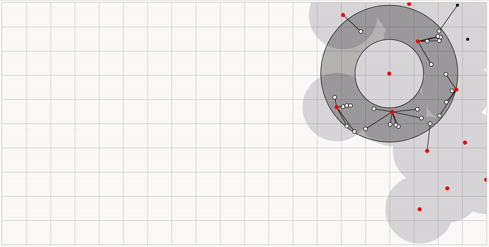

# 2.2.6 Cycle 6: Item generation

## Design

### Objectives

The goal of this cycle will be to create an item system that will randomly generate a range of items with different types and appearances to be rendered on the map. They will need to be randomly generated within the bounds of the defined polygon, and at a constant density for the area. I will also add a popup that will appear on click and on proximity to each item, as well as some simple icon-based sprites. I will not implement a player inventory system (picking up and dropping items) in this cycle - I plan to complete this in a separate cycle

* [x] Randomly generate different items across the map and display them to the client
  * [x] Handle rarity of items - rarer items should be less likely to be generated
* [x] Show different icon sprites for each item rendered on the client
* [x] Display a popup above each item with more details on click and on proximity

### Usability Features

* Ensure the item popups are large enough to be legible
  * Clearly display the rarity of the item to make the game more accessible to first time players - it will help them to know when an item is worth picking up
* Use different colours for each item for increased visibility
* (Potential) Add an information button on each popup to give more information about the function of the device. I may not add this here, as I plan to include detailed instructions in the inventory screen once the player picks up the item.

### Key Variables

| Variable Name | Use                                                                                                                                      |
| ------------- | ---------------------------------------------------------------------------------------------------------------------------------------- |
| items         | A list of items stored in the game object that will include various information about the item, including its type, location and rarity. |
| vertices      | A list of co-ordinates for the vertices of the polygon - this will be used to define the bounds of item generation                       |

### Pseudocode

```
subroutine generate_items(vertices)
    items = []
    area = get vertices area in m^2
    itemCount = area / DENSITY_CONSTANT
    
    for x in range(itemCount)
        id = uuid()
        type = generate_random_type()
        
        constraints = get constraints for point
        point = generate_point(vertices, contraints)
        
        details = details[type]
        items.push({id, point, type, details})
    end for
    
    return items
end subroutine
    
subroutine generate_point(vertices, contraints)  
    maxLongitude = max(v.lng for v of vertices)
    minLongitude = min(v.lng for v of vertices)
    maxLatitude = max(v.lat for v of vertices)
    minLatitude = min(v.lat for v of vertices)
    
    randLongitude = rand(minLongitude, maxLongitude)
    randLatitude = rand(minLatitude, maxLatitude)
    
    point = [randLongitude, randLatitude]
    
    if point not in vertices or distance from constraint.point < constraint.distance
        return generate_point(vertices)
    else
        return point
end subroutine

subroutine generate_random_type()
    // Examples
    types = {
        "a": 6
        "b": 3
        "c": 1
    }
    typesList = []
    
    for type in types 
        for i in types.value
            typesList.push(type.name)
        end for
    end for 
    
    return random item from typesList
end subroutine
```

### UI Mockup

 (1) (2).png>)

## Development

### Outcome

#### Generating Points

The items could have been generated on a map simply by creating a bounding box around the polygon, and generating random points recursively, generating a new point if the randomly generated point does not fall within the polygon (using the algorithm created in [cycle-1-2.md](cycle-1-2.md "mention")

<figure><figcaption><p>This is an example box filled with random points</p></figcaption></figure>

However, whilst developing, I realised there were several unanticipated caveats to this approach. As you can see in the above example, there are regions of overlap and empty space; in other words, it is random but not even. So I want to have randonimity , _but_ even distribution, which sounds impossible! Upon doing some research, I found that several such algorithms exist, with the one I decided to go with being **Poisson Disc Sampling** due to its speed and simplicity.

<figure><figcaption><p>A visualisation of the Poisson-Disc Sampling algorithm</p></figcaption></figure>

To determine the relevant steps to replicate this algorithm in JavaScript, I used this excellent blog post by Mike Bostock, [Visualizing Algorithms](https://bost.ocks.org/mike/algorithms/), as well as a concise paper authored by Robert Bridson, titled [Fast Poisson Disk Sampling in Arbitrary Dimensions](https://www.cs.ubc.ca/\~rbridson/docs/bridson-siggraph07-poissondisk.pdf). The simplified steps are detailed below:

> Step 0
>
> Initialize an n-dimensional background grid for storing samples and accelerating spatial searches. We pick the cell size to be bounded by r/√ n, so that each grid cell will contain at most one sample, and thus the grid can be implemented as a simple n-dimensional array of integers: the default −1 indicates no sample, a non-negative integer gives the index of the sample located in a cell.&#x20;
>
> Step 1
>
> Select the initial sample, x0, randomly chosen uniformly from the domain. Insert it into the background grid, and initialize the “active list” (an array of sample indices) with this index (zero).&#x20;
>
> Step 2
>
> While the active list is not empty, choose a random index from it (say i). Generate up to k points chosen uniformly from the spherical annulus between radius r and 2r around xi. For each point in turn, check if it is within distance r of existing samples (using the background grid to only test nearby samples). If a point is adequately far from existing samples, emit it as the next sample and add it to the active list. If after k attempts no such point is found, instead remove i from the active list.

([Bridson, 2007](../reference-list.md))

<figure><figcaption><p>This is an example box filled with points generated using the Poisson-Disc Sampling Algorithm</p></figcaption></figure>

Using this sampling technique, I created a JavaScript implementation, as detailed below:


```typescript
export function poissonDiscSampling(vertices: {lng: number; lat: number}[]) {
  // These define the constants for the program:
  // radius: The minimum distance between two points in metres
  // k: The maximum number of samples to take from a given point
  // cellSize: The size of each cell (can only contain one point)
  const radius = 200;
  const k = 10;
  const cellSize = radius / Math.sqrt(2);

  // This defines the bounding points of the surrounding "box" (lat, lng)
  const {ranges} = getBoxPoints(vertices);
  const [latMin, latMax] = ranges.lat;
  const [lngMin, lngMax] = ranges.lng;
  
  // Gets the width and height of bounding box in metres
  const {width, height} = dimensions(vertices);
  
  // Defines the amount of cells for the width and height of the bounding box
  const gridWidth = Math.ceil(width / cellSize);
  const gridHeight = Math.ceil(height / cellSize);
  
  // Helper functions that give the x,y (and combined) position of a cell, of         
  // a given lng, lat point 
  const gridX = (p: {x: number; y: number}) =>
    Math.floor(distance([lngMin, p.y], [p.x, p.y]) / cellSize);
  const gridY = (p: {x: number; y: number}) =>
    Math.floor(distance([p.x, latMin], [p.x, p.y]) / cellSize);
  const gridIndex = (p: {x: number; y: number}) => {
    return gridX(p) + gridWidth * gridY(p);
  };
  
  // Generates a random point inside the polygon and gets its grid index
  const randomPointLngLat = randomPointInsidePolygon(ranges, vertices);
  const randomPoint = {x: randomPointLngLat.lng, y: randomPointLngLat.lat};
  const randomPointIndex = gridIndex(randomPoint);

  // Initialises object containing point data, and list of active grid indices
  const points = {
    [randomPointIndex]: randomPoint,
  };
  const activePoints = [randomPointIndex];

  // Gets the indices of the surrounding 25 cells for a given point (5x5 grid)
  const getNeighbors = (p: {x: number; y: number}) => {
    const x = gridX(p);
    const y = gridY(p);

    const options = [-2, -1, 0, 1, 2]
      .flatMap(dx => [-2, -1, 0, 1, 2].map(dy => [x + dx, y + dy]))
      .filter(([x, y]) => x >= 0 && y >= 0 && x <= gridWidth && y <= gridHeight)
      .map(([x, y]) => x + y * gridWidth);

    return options;
  };
  
  // Radius of the earth in metres
  const r_earth = 6378 * 1000;

  while (activePoints.length > 0) {
  
    // Gets lng,lat of a random active point
    const point = points[activePoints[Math.floor(Math.random() * activePoints.length)]];

    // Defines sample size as k + 1, so that when k samples are passed (the max)
    // a seperate routine can run to remove "point" from the list of active points
    let sampleSize = k + 1;
    for (let i = 0; i < sampleSize; i++) {
      if (i === k) {
        activePoints.splice(activePoints.indexOf(gridIndex(point)), 1);
      }
      
      // Picks a random angle and distance (between r and 2r, m), to generate a
      // sample point
      const angle = randomBetweenInterval(0, Math.PI * 2);
      const distanceFromPoint = randomBetweenInterval(radius, radius * 2);

      // Creates a new point (lng, lat), combining the values above with the point
      // to create a new point. 
      // Credit: nibot - https://stackoverflow.com/a/7478827/9918744
      const newPoint = {
        x: point.x + ((Math.cos(angle) * distanceFromPoint) / r_earth) * (180 / Math.PI),
        y:
          point.y +
          (((Math.sin(angle) * distanceFromPoint) / r_earth) * (180 / Math.PI)) /
            Math.cos((point.x * Math.PI) / 180),
      };

      // Determines whether a point already exists in the cell of the sample
      // If so, we reject the sample
      const index = gridIndex(newPoint);
      const occupied = points[index];
      
      if (occupied) continue;
      
      // For my use-case, I need to ensure that all points generated fall within
      // the polygon. I made sure that rejecting a point if it was not inside,
      // did not affect the sample size, as this would have a disproportionate
      // impact on sample generation at the edges of the polygon
      if (!isPointInsidePolygon({lng: newPoint.x, lat: newPoint.y}, vertices)) {
        sampleSize += 1;
        continue;
      }
      
      const neighbors = getNeighbors(newPoint);
      if (
      // Checks that every 2x neighbouring cell is either empty, or the point is
      // more than one radius away
        neighbors.every(n => {
          if (!points[n]) return true;
          return distance([newPoint.x, newPoint.y], [points[n].x, points[n].y]) > radius;
        })
      ) {
        // Adds a active new point, and breaks out of the loop to select a new
        // active point
        points[index] = newPoint;
        activePoints.push(index);
        break;
      }
    }
  }
  // Returns the points as a list of lng,lat co-ordinates
  return Object.values(points).map(p => ({lng: p.x, lat: p.y}));
}
```


<figure><figcaption><p>This is a diagram illustrating a bounding box </p></figcaption></figure>

The `randomPointInsidePolygon` routine vital to the above subroutine is a recursive function that picks a random point within the bounding box. If, using the `isPointInsidePolygon` routine created in [cycle-1-2.md](cycle-1-2.md "mention"), the point is outside the polygon, we simply call the function again, until a valid point is generated.

#### Creating a item

Once the array of points is created, it is looped through, instantiating a new Item class for each point. The item must have a weighted random rarity and type, and the routine for generating this is demonstrated below:

```typescript
  // Takes the item type as a parameter
  private generateItemType(type: 'hunter' | 'hunted') {
    const types = {
      hunted: [
        {
          name: 'GPS Jammer',
          code: 'gpsj',
          baseRarity: 1,
        },
        ...
      ],
      hunter: [
        {
          name: 'Phone triangulator',
          code: 'ptgr',
          baseRarity: 1,
        },
        ...
      ],
    };
    // Creates an weighted array of all the items for the given class i.e. a rarer
    // item is less common in the array
    const typesToSelect = types[type].flatMap(type =>
      Array(10 - type.baseRarity).fill(type)
    ) as typeof types['hunter' | 'hunted'];

    // Picks an item randomly from the above weighted array
    const item = typesToSelect[Math.floor(Math.random() * typesToSelect.length)];

    // Creates a weighted rarity array, ensuring that all rarities in the array
    // are above the base rarity.
    const rarityArr = [1, 1, 1, 2, 2, 3].filter(v => v >= item.baseRarity) as (1 | 2 | 3)[];
    
    // Picks an item rarity from the above weighted array
    const rarity = rarityArr[Math.floor(Math.random() * rarityArr.length)];

    return {
      ...item,
      type,
      rarity,
    };
  }
```

Sending the item data to the client was done using the `game-init` socket event, and was added to the client side "game" object. The changes on the client were almost exclusively aesthetic, although I did refactor the `<PlayerMarker/>` component of [cycle-1-1.md](cycle-1-1.md "mention")  into a reusable `<Marker/>` component, allowing it to also be used for the item markers.

### Challenges

There were a lot this Cycle...

#### **Implementing the Poisson-Disc Algorithm**

This took several hours and led to lots of frustration, due to primarily my conversions of longitude and latitude to x,y co-ordinates. This made it easier for me to write and interpret my code, however it paved the way for lots of mis-matched objects, when I had gotten confused between latitude (y) and longitude (x).

It was resolved by using logging tools (namely `console.log`), to identify exactly where the units were being mismatched.

#### Sending item data to the client

Although Socket.IO has a generous limit of 1MB for individual message size, it has issues when converting large array of objects (items\[]), into the binary data format required. This was resolved by consulting StackOverflow and finding that the issue could be resolved if I converted the JavaScript list into a string-based, JSON structure, using `JSON.stringify`

## Testing

### Tests

| Test | Instructions                            | What I expect                                                     | What actually happens                             | Pass/Fail |
| ---- | --------------------------------------- | ----------------------------------------------------------------- | ------------------------------------------------- | --------- |
| 1    | Create & start a game with a small area | Items to be randomly and evenly distributed across the map        | As expected                                       | Pass      |
| 2    | Create & start a game with a large area | Items to be randomly and evenly distributed across the map        | The game hangs before the create request timeouts | Fail      |
| 3    | (Within Game) Click on an item          | A popup appears detailing item stats                              | As expected                                       | Pass      |
| 4    | (Within Game) Observe item distribution | The rarities and types are appropriately distributed (noticeably) | The distribution is too subtle and seems random   | Fail      |


Although not an explicit test, the game rendered and ran incredibly slowly, with location changes taking several seconds to be reflected on-screen. I suspect this is due to unnecessary re-rendering of the entire items array, as well as the costly re-computation of item distances. I will fix this next Cycle as it is a non-trivial fix.


### Failing Tests

#### Test 2

There doesn't appear to be a great way to rectify this issue - it lies with the efficiency of the algorithm (a respectable O(n)), which can't handle generating millions of evenly distributed items. This could be rectified by using simple random generation, but would result in the caveats discussed earlier.

I think the simplest solution is to reject a game creation with an error if the bounding area is too large. In future, I could experiment with "just-in-time" generation, generating items within a certain area around players, and restricting the panning and zooming on the map (similarly to [#pokemon-go](../1-analysis/1.3-research-the-problem.md#pokemon-go "mention"))

```typescript
app.post('/create', (req, res) => {
...
    const {width, height} = dimensions(result.data.options.vertices);
    // If the game is more than 30km^2, return an error
    if (width * height > 30 * 1000 ** 2) {
        return res.status(400).send(JSON.stringify({data: 'Map is too large'}));
    }
...
});
```

#### Test 4

I rectified this by multiplying the distribution variable by a constant in the `typesToSelect` list, to increase the disparity in probabilities and modified the `rarityArr` element ratio from 3:2:1, to 9:3:1

<pre class="language-typescript" data-line-numbers><code class="lang-typescript">const typesToSelect = types[type].flatMap(type =>
<strong>    Array(10 - type.baseRarity * 3).fill(type)
</strong>) as typeof types['hunter' | 'hunted'];

const item = typesToSelect[Math.floor(Math.random() * typesToSelect.length)];

const rarityArr = [1, 1, 1, 1, 1, 1, 1, 1, 1, 2, 2, 2, 3].filter(v => v >= item.baseRarity)</code></pre>

### Evidence

#### Test 1

 (1).png>)

#### Test 2 (Rectified)

.png>)

#### Test 3

 (3).png>)

#### Test 4 (Rectified)

<figure><figcaption></figcaption></figure>
